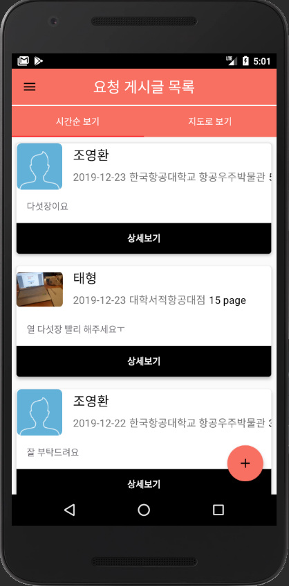
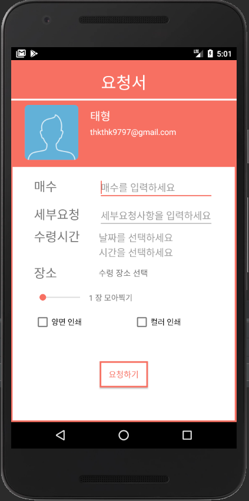
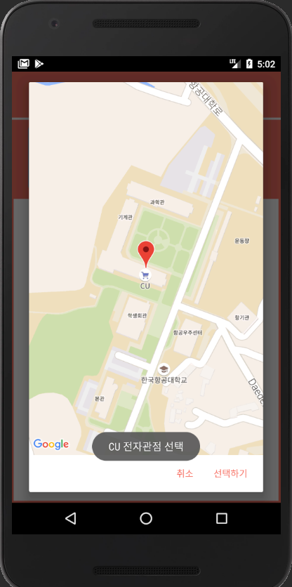
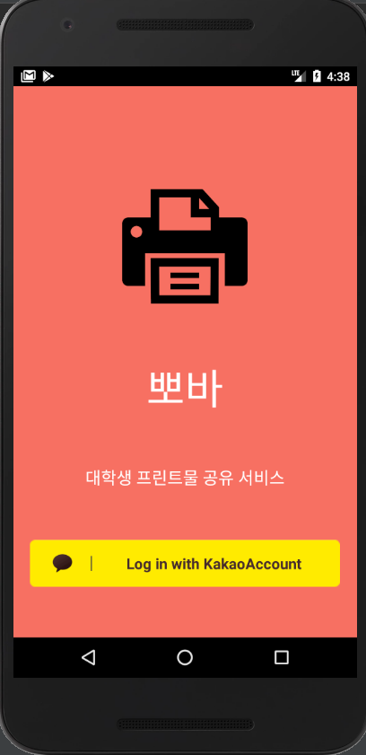
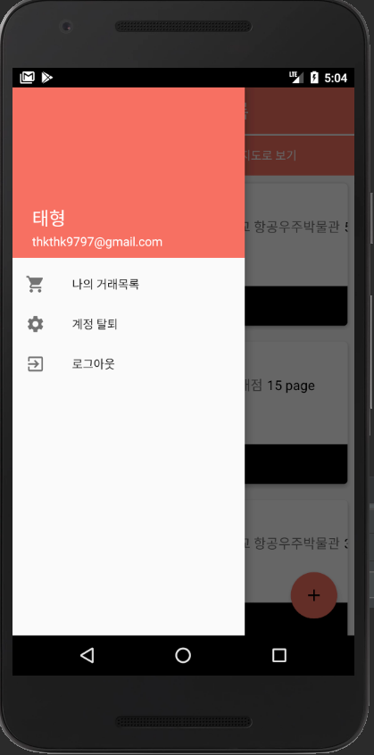
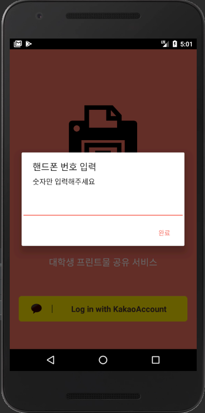
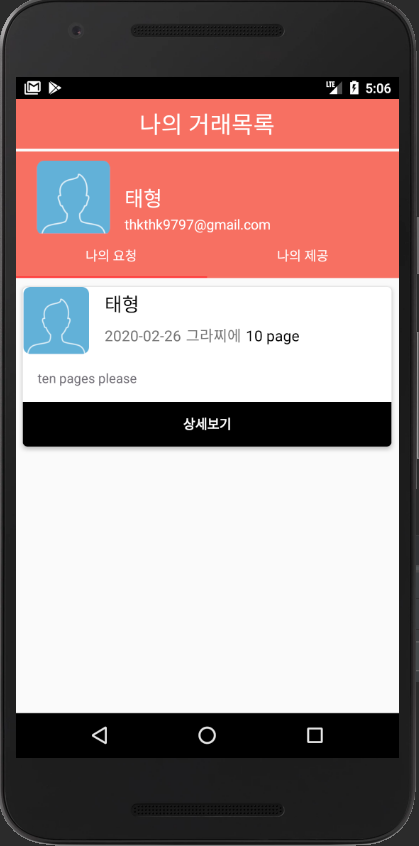

# [뽀바] Prints_Trade_Mediation_Application
> 프린트물 출력서비스 거래 중개 어플리케이션 "**뽀바**"

## Motivation / Introduction
2019년 2학기 모바일SW스튜디오수업에서 텀프로젝트로 제작하였습니다.  
**뽀바**는 수업시간에 프린트를 바로 받아볼 수 있는 서비스의 필요성에 대해 생각했습니다.  
또한 영리 활동을 목적으로 만든 것이 아님을 밝힙니다.

**'뽀바'** 어플리케이션은  
프린트가 가능한 환경에 있는 '**제공자**'가  
프린트가 불가능한 환경에 있는 '**요청자**'에게  
소정의 수고료를 받고 프린트물을 뽑아서 배달해주는  
**학생 to 학생**  
**프린트물 거래 중개 어플리케이션**입니다.

## How to use

  
  
**어플의 메인 페이지 / 프린트물 요청 페이지**  
 메인 페이지의 +버튼을 누르면 프린트물 요청 페이지로 넘어갑니다.  
 

  
  
  **프린트물 요청 페이지**  
요청 페이지에서 날짜와 시간, 만날 장소를 정한 후 요청글을 작성 완료합니다.  
  

  

**어플 로그인 화면 / 메인메뉴**  
 어플 첫 접속시 회원가입을 진행합니다.(카카오 로그인 이용)  
 어플 메인화면의 메인메뉴 화면에서 원하는 메뉴를 선택할 수 있습니다.  
 

  

 **어플 로그인 화면 / 내 요청글 메뉴 화면**  
 어플 로그인 후 SMS알림을 위해 전화번호를 입력합니다.  
 내 요청글 메뉴에서 내가 쓴 요청글들을 확인할 수 있습니다.
 
## Tech used  
* language : Kotlin, XML
* tool : Android Studio
* database : Firebase
* API :  
  + google : Geocoding API, Maps SDK for Android, Plcaes API  
  + kakao: KAKAO API  

## Test Device  
* Galaxy Note9 (Android 9, API 28)
* Nexus 5X (Android 7, API 24)

## License  
MIT License  
MIT © TaeHyung Kwon
